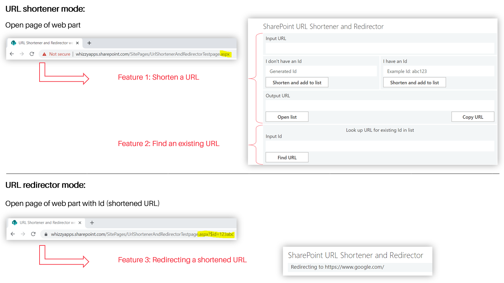

## SharePoint URL Shortener and Redirector web part

A modern SharePoint Online web part, released as open source under the [MIT License](https://choosealicense.com/licenses/mit/).

Documentation: https://sharepoint-url-shortener.com/

The web part makes it possible to create and redirect shortened URLs. You have 3 features:

1. If you open the page of the web part, you can shorten a URL and add it to the database.
2. You can also find a URL in the database, that has already been shortened.
3. If you paste the shortened URL in the browser, the web part will redirect to the target URL.



### Building the code
Note: **Ensure that Node.js V10.x is installed. Do not use newer versions!** Node.js V14.x and V16.x will not work. They will install a newer gulp-cli that includes a newer gulp-sass module which will throw an error.
 - For 64bit Windows use [this Node.js installer](https://nodejs.org/download/release/v10.24.1/node-v10.24.1-x64.msi). 
 - On other systems download from <a style="align-self: flex-start;" href="https://nodejs.org/download/release/v10.24.1/" target="_blank">Node.js V10.x </a>.

To build the code on Windows, run ```ship.bat```. On other systems use

```bash
npm install gulp-cli -g
npm install
gulp clean
gulp build
gulp bundle --ship
gulp package-solution --ship
```

It outputs the file ```[PROJECT_DIR]\sharepoint\solution\url-shortener-and-redirector-webpart.sppkg```.

### Testing the web part in the browser

On Windows, run ```run.bat```. On other systems use

```bash
npm install
gulp serve
```